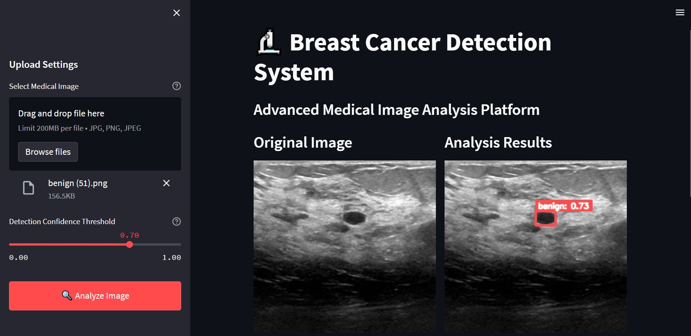

# Breast Cancer Detection System

An advanced medical image analysis platform that uses deep learning to detect and classify breast cancer lesions in ultrasound images.



## Features

- **Real-time Analysis**: Upload and analyze medical images instantly
- **Interactive Interface**: User-friendly design with drag-and-drop functionality
- **Adjustable Detection Threshold**: Fine-tune the confidence threshold for detections
- **Detailed Results**: Side-by-side comparison of original and analyzed images
- **Comprehensive Findings**: Detailed analysis report with confidence scores and precise locations

## User Interface

The application consists of two main sections:

### 1. Sidebar Controls
- File upload section with support for JPG, PNG, and JPEG formats
- Maximum file size limit of 200MB
- Adjustable detection confidence threshold slider (0.00 - 1.00)
- "Analyze Image" button to trigger the analysis

### 2. Main Display
- Original ultrasound image
- Analysis results with detected regions
- Detailed findings section showing:
  - Classification (benign/malignant)
  - Confidence scores
  - Precise location coordinates

## Analysis Results

The system provides:
- Visual markers on detected regions
- Color-coded classifications:
  - Green boxes for benign findings
  - Red boxes for malignant findings
- Confidence scores for each detection
- Exact location coordinates (X, Y) for each finding


## Technical Details

### Detection Results Format
```
Finding 1
Classification: benign
Confidence Score: 72.57%
Location: X: 0.50, Y: 0.29
```

### File Requirements
- Supported formats: JPG, PNG, JPEG
- Maximum file size: 200MB
- Image should be a clear ultrasound scan

## Usage Instructions

1. Open the application in your web browser
2. Use the sidebar to upload your medical image:
   - Click "Browse files" or drag and drop
3. Adjust the detection confidence threshold if needed (default: 0.70)
4. Click "Analyze Image" to process the image
5. Review the results in the main display area
6. Check the detailed findings section for comprehensive analysis

## Model Performance

The system uses a sophisticated deep learning model trained on medical imaging data. The default confidence threshold is set to 0.70, which provides a good balance between sensitivity and specificity. Users can adjust this threshold based on their specific needs:
- Higher threshold (>0.70): More confident predictions but might miss some findings
- Lower threshold (<0.70): More sensitive detection but may increase false positives

## Important Notes

- This tool is designed to assist medical professionals and should not be used as the sole diagnostic tool
- Always consult with qualified healthcare providers for medical decisions
- The system works best with high-quality ultrasound images
- Results should be verified by trained medical professionals

## Run the web application

1. Install the required packages:
    ```bash
    pip install -r requirements.txt
    ```

2. Navigate to the model architecture directory:
    ```bash
    cd model_architecture
    ```

3. Run the Streamlit app with the specified model and label map:
    ```bash
    python -m streamlit run app.py
    ```


## Development

Built with:
- Streamlit for the web interface
- TensorFlow for the deep learning model
- OpenCV for image processing
- Python for backend processing


---

*Note: This is a medical analysis tool and should be used by qualified healthcare professionals as part of a comprehensive diagnostic process.*
